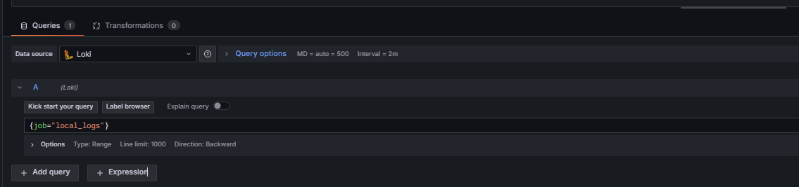

# Install Loki with Docker or Docker Compose

Official Docs: [Grafana Loki Docker Setup](https://grafana.com/docs/loki/latest/setup/install/docker/)

---

## Precondition

- [Docker](https://docs.docker.com/get-docker/) installed

---

## Install Loki with Docker Compose

1. **Create and move into the Loki working directory**:
    ```bash
    mkdir loki
    cd loki
    ```

2. **Download the official `docker-compose.yaml` file**:
    ```bash
    wget https://raw.githubusercontent.com/grafana/loki/v3.4.1/production/docker-compose.yaml -O docker-compose.yaml
    ```

3. **Start Loki and its dependencies**:
    ```bash
    docker-compose -f docker-compose.yaml up
    ```

4. **Verify Loki is running**:
    - Readiness check: [http://localhost:3100/ready](http://localhost:3100/ready)
    - Metrics endpoint: [http://localhost:3100/metrics](http://localhost:3100/metrics)

---

## Build a Dashboard in Grafana

Dashboard Docs: [Build Grafana Dashboards](https://grafana.com/docs/grafana/latest/dashboards/build-dashboards/)

### 1. Configure Loki as a Data Source

- Guide: [Configure Loki Data Source](https://grafana.com/docs/grafana/latest/datasources/loki/configure-loki-data-source/)

### 2. Create a New Dashboard

1. Open Grafana at [http://localhost:3000](http://localhost:3000)
2. In the sidebar, go to **Dashboards > New > New Dashboard**
3. Click **+ Add visualization**
4. Set the **Data source** to `Loki`
5. Use a query such as:
    ```logql
    {job="local_logs"}
    or
    {filename="/mnt/log/app.log"}
    ```
6. Customize your visualization as needed
7. Save the dashboard

> 
